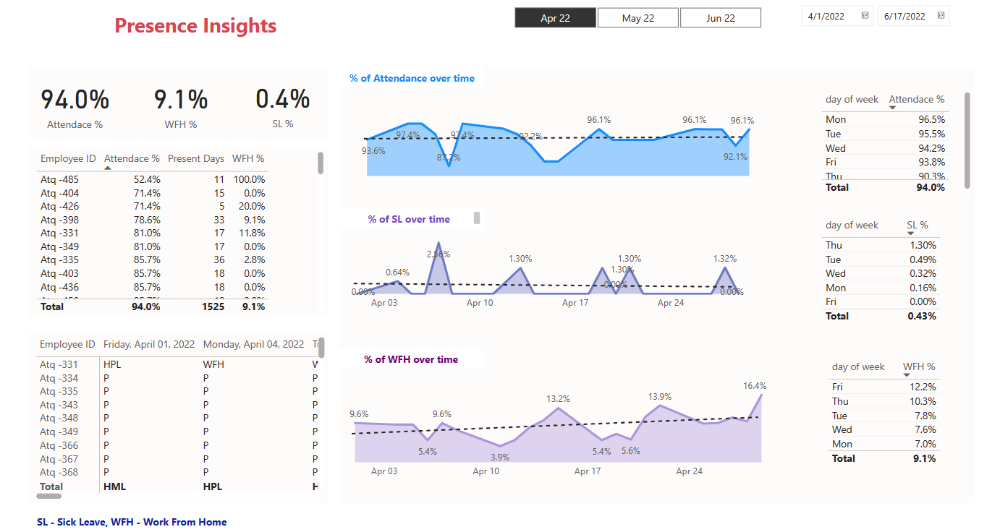

# HR Analytics Dashboard

## Table of Contents

- [Introduction](#introduction)
- [Features](#features)
- [Contribution](#Contribution)
- [License](#license)

## Introduction

The HR Analytics Dashboard is a powerful tool for HR professionals, managers, and decision-makers to access crucial employee metrics, track performance, and make informed decisions. This dashboard provides insights into your workforce, allowing you to optimize talent management and improve organizational effectiveness.

## Features

- Access key employee metrics, performance scores, and more.
- Visualize HR data through interactive charts and graphs.
- Customizable reports to meet specific HR objectives.
- User-friendly interface for easy navigation and data exploration.

## Usage
The dashboard is designed for HR professionals and decision-makers. Use it to analyze employee metrics, identify trends, and make data-driven decisions to enhance HR strategies and employee management.

## Contribution

We welcome contributions to the HR Analytics Dashboard project. If you have ideas for improvements or would like to report issues, please open an issue or submit a pull request. Review our Contributing Guidelines for more information.

